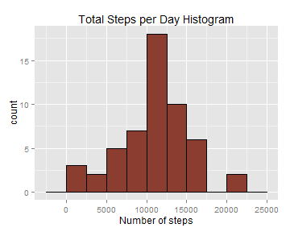

# Reproducible Research: Peer Assessment 1  

### *Loading and preprocessing the data* 

*Show any code that is needed to:*  

*1. Load the data (i.e. ```read.csv()```)* 

*2. Process/transform the data (if necessary) into a format suitable for your analysis}*

First of all, let`s load data into memory from disk.

```r
actData <- read.csv("activity.csv")
```

### *What is mean total number of steps taken per day?*  

*For this part of the assignment, you can ignore the missing values in the dataset.*

*1. Calculate the total number of steps taken per day.* 

First an aggregation by date must be done on activity data, then steps for each day will be summed.  


```r
splitDate <- split(actData,actData$date)          
stepsPerDay <- sapply(splitDate, function(x) sum(x$steps))
```


*2. If you do not understand the difference between a histogram and a barplot, research the difference between them. Make a histogram of the total number of steps taken each day*  


```r
library(ggplot2)
qplot(stepsPerDay, geom="histogram", binwidth = 2500, main = "Total Steps per Day Histogram", 
      xlab = "Number of steps", fill=I("coral4"), col=I("black"))
```



*3. Calculate and report the mean and median of the total number of steps taken per day.*


```r
meanSteps <-mean(stepsPerDay,na.rm=TRUE)
medianSteps <- median(stepsPerDay,na.rm=TRUE)
```


**Number of steps mean: 10766.19**   
**Median for number of steps distribution: 10765**

### *What is the average daily activity pattern?*
*1. Make a time series plot (i.e. type = "l") of the 5-minute interval (x-axis) and the average number of steps taken, averaged across all days (y-axis).*


```r
aggAcData <- aggregate(actData$steps,by=list(actData$interval),mean,na.rm=TRUE)
graph <- ggplot(aggAcData, aes(y=x,x=1:288))
graph <- graph + geom_line(colour="#000099")
graph <- graph + scale_x_discrete(breaks=seq(from=1,to=288,by=12), labels=paste(seq(0,23),"00",sep=":"))
graph <- graph + labs(title="Average Daily Activity Pattern", x="time", y="average steps")
graph <- graph + theme(axis.text.x = element_text(angle = 90))
graph
```


*2. Which 5-minute interval, on average across all the days in the dataset, contains the maximum number of steps?*


```r
maxInterval <- aggAcData$Group.1[which.max(aggAcData$x)]
maxStepsMean <- max(aggAcData$x)
```

**Maximum steps mean is 206.17 at interval 8:35 to 8:40**

### *Imputing missing values*  

*Note that there are a number of days/intervals where there are missing values (coded as NA). The presence of missing days may introduce bias into some calculations or summaries of the data.*  

*1. Calculate and report the total number of missing values in the dataset (i.e. the total number of rows with NAs)*  


```r
missingValueRows <- which(is.na(actData$steps))
missingValues <- length(missingValueRows)
```

**The total number of missing values in the dataset is 2304** 

*2. Devise a strategy for filling in all of the missing values in the dataset. The strategy does not need to be sophisticated. For example, you could use the mean/median for that day, or the mean for that 5-minute interval, etc.*  

The missing values will be filled with mean for that interval.  

*3. Create a new dataset that is equal to the original dataset but with the missing data filled in.*  


```r
filledDataSet <- actData
filledDataSet[missingValueRows,"steps"] <- 
        sapply(actData[missingValueRows,"interval"] , 
               find<- function(x) aggAcData[which(aggAcData[,1]==x),2])
```

*4. Make a histogram of the total number of steps taken each day and Calculate and report the mean and median total number of steps taken per day. Do these values differ from the estimates from the first part of the assignment? What is the impact of imputing missing data on the estimates of the total daily number of steps?*  


```r
splitDateFilled <- split(filledDataSet,filledDataSet$date)          
stepsPerDayFilled <- sapply(splitDateFilled, function(x) sum(x$steps))
qplot(stepsPerDayFilled, geom="histogram", binwidth = 2500, 
      main = "Total Steps por Day Histogram with Filled NAs Values", 
      xlab = "Number of steps", fill=I("coral4"), col=I("black"))
```


```r
aggFilledData <- aggregate(filledDataSet$steps,by=list(filledDataSet$date),sum,na.rm=TRUE)
meanFilledSteps <-mean(aggFilledData$x)
medianFilledSteps <- median(aggFilledData$x)
```


**mean of number of steps after filling NAs: 10766.19**   
**median of number of steps after filling NAs: 10766**  

###*Are there differences in activity patterns between weekdays and weekends?*  

*For this part the weekdays() function may be of some help here. Use the dataset with the filled-in missing values for this part.*  

*1. Create a new factor variable in the dataset with two levels - "weekday" and "weekend" indicating whether a given date is a weekday or weekend day.*  


```r
filledDataSet$dayType <- as.factor(as.POSIXlt(filledDataSet$date)$wday %in% c(0,6))
levels(filledDataSet$dayType) <- c("weekday","weekend")
```

*2. Make a panel plot containing a time series plot (i.e. type = "l") of the 5-minute interval (x-axis) and the average number of steps taken, averaged across all weekday days or weekend days (y-axis). See the README file in the GitHub repository to see an example of what this plot should look like using simulated data.*  


```r
aggFilledDataWD <- aggregate(filledDataSet$steps,
                             by=list(filledDataSet$dayType,filledDataSet$interval),mean)
wdData <- subset(aggFilledDataWD,aggFilledDataWD$Group.1=="weekday")
weData <- subset(aggFilledDataWD,aggFilledDataWD$Group.1=="weekend")

graph1 <- ggplot(wdData, aes(y=x,x=1:288))
graph1 <- graph1 + geom_line(colour="#000099")
graph1 <- graph1 + scale_x_discrete(breaks=seq(from=1,to=288,by=12), labels=paste(seq(0,23),"00",sep=":"))
graph1 <- graph1 + labs(title="weekdays", x="time", y="average steps")
graph1 <- graph1 + theme(axis.text.x = element_text(angle = 90))

graph2 <- ggplot(weData, aes(y=x,x=1:288))
graph2 <- graph2 + geom_line(colour="#000099")
graph2 <- graph2 + scale_x_discrete(breaks=seq(from=1,to=288,by=12), labels=paste(seq(0,23),"00",sep=":"))
graph2 <- graph2 + labs(title="weekends", x="time", y="average steps")
graph2 <- graph2 + theme(axis.text.x = element_text(angle = 90))

library(grid)
pushViewport(viewport(layout = grid.layout(2, 1)))
print(graph1, vp = viewport(layout.pos.row = 1, layout.pos.col = 1))
print(graph2, vp = viewport(layout.pos.row = 2, layout.pos.col = 1))
```


```r
meanWeekdays <- mean(wdData$x)*288
meanWeekends <- mean(weData$x)*288
```

**Mean steps during weekdays 10255.8  
Mean steps during weekends 12201.5**   

During weekends a 19.0 % steps increment is verified from the mean during weekdays. Also the distribution is different. During weekdays a peak in steps appears between 8:00 and 9:00 while during weekends the steps taken are distributed along the day, from 8:00 to 21:00.
